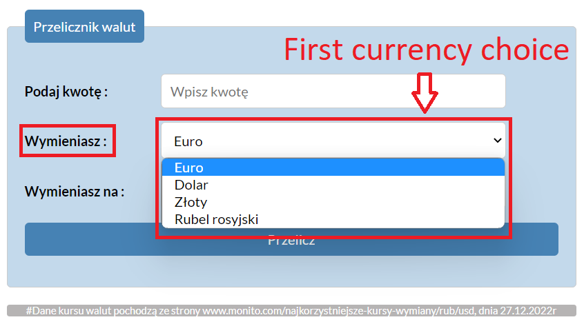
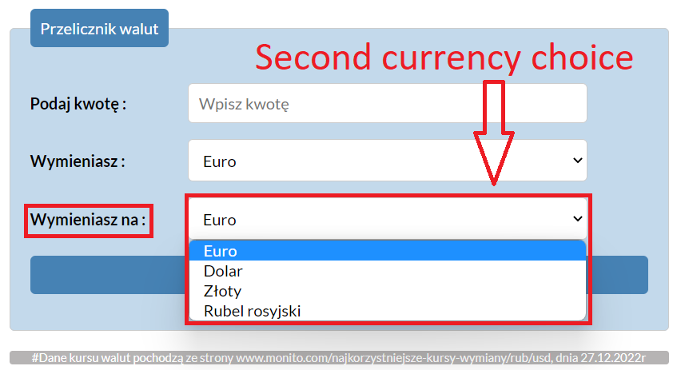

# Currency conventer 

## **Link to the website:**
https://sajrim.github.io/Currency-conventer-/

## The website is in polish language. Allowes you to choose out of bunch curriencies to convert the value from one to another.

## Technology used in the project:
- HTML
- CSS
- Markdown
- JavaScript
- ES6+ Feature
- BEM convention
- Normalize CSS
- GIT

